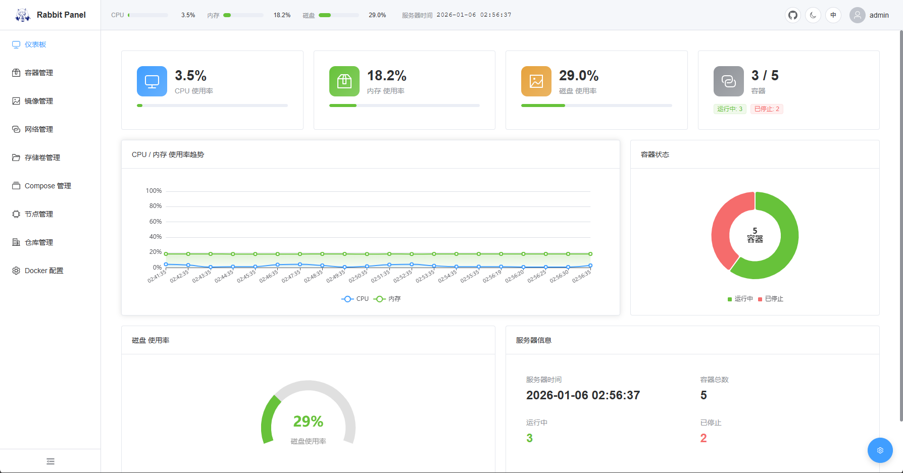
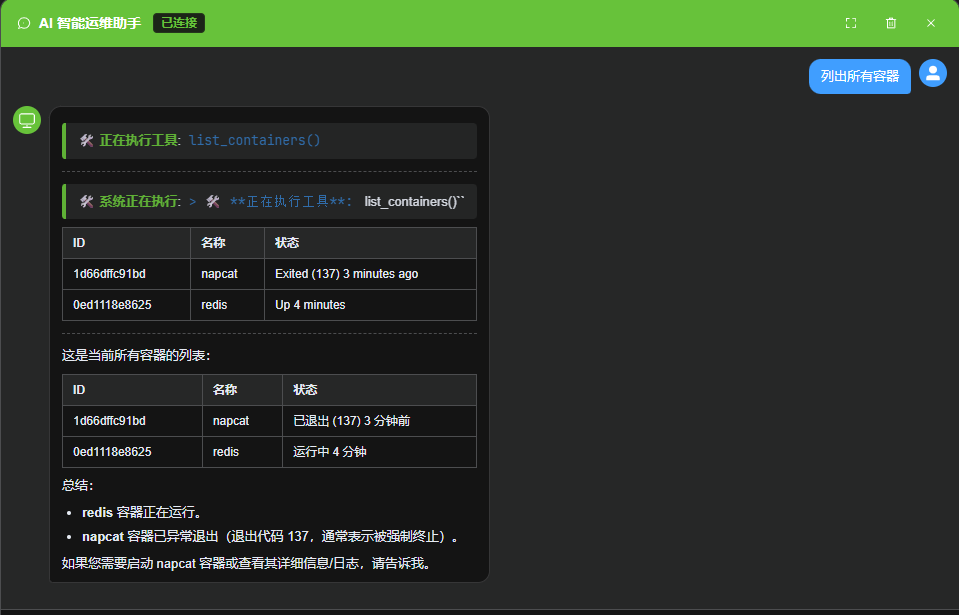
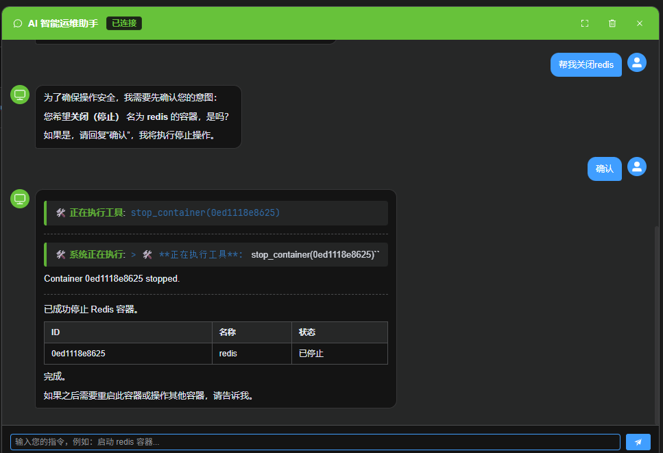
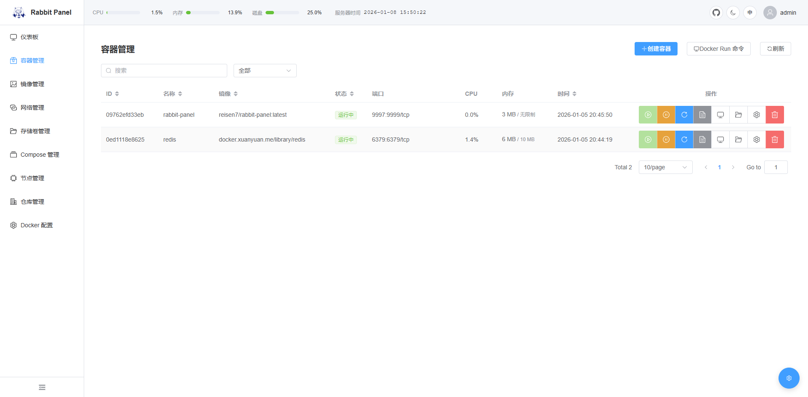
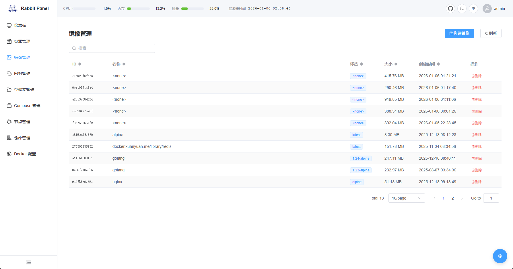
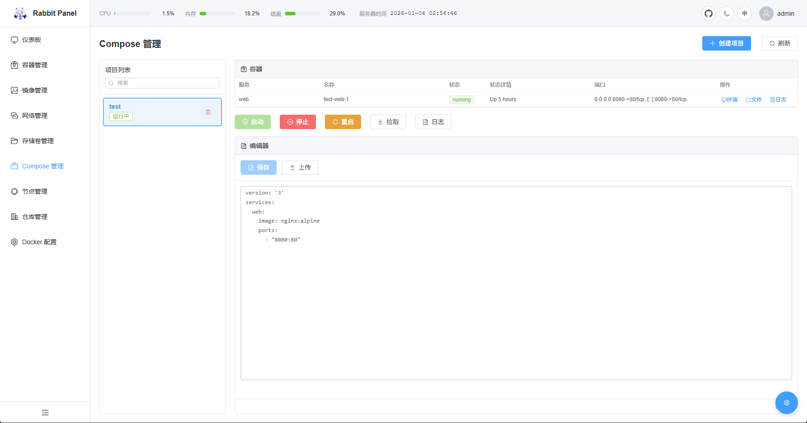
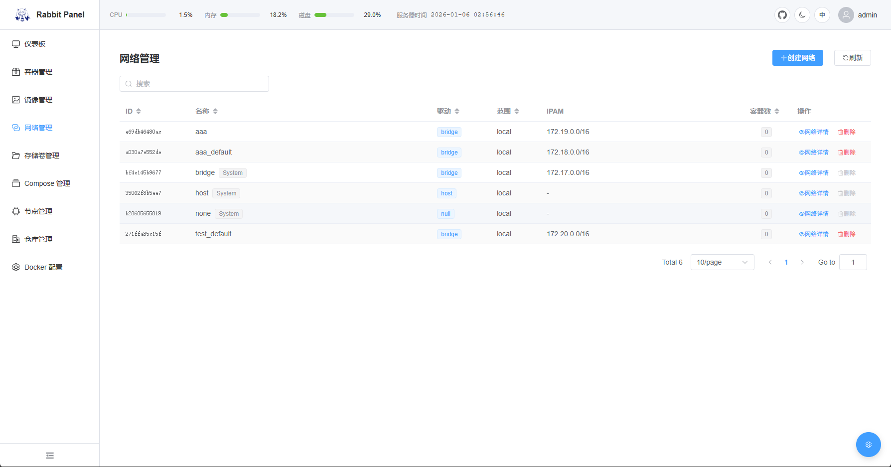
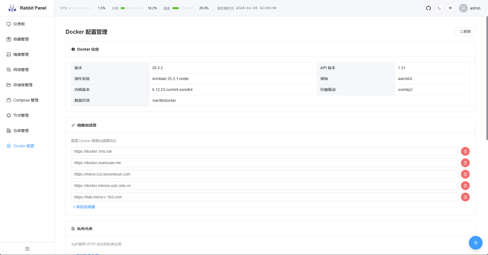

# Rabbit Panel ｜ 极致轻量AI智能容器运维面板

一个极致轻量的 AI 智能 Docker 运维面板，面向 4GB 内存设备，支持 ARM64 / armv7l / x86_64，多节点集中管理，AI 智能运维，开箱即用。默认端口3958（39舞宝）

## 特性

- 🚀 **极致轻量**：运行时内存 ≤ 30MB，二进制 ≤ 10MB
- 🐳 **容器管理**：启动/停止/重启/删除，实时日志（SSE），终端访问，文件管理
- 📦 **镜像管理**：查看、删除、构建镜像
- 🌐 **网络管理**：创建/删除网络，查看网络详情和连接的容器
- 💾 **存储卷管理**：创建/删除存储卷，批量清理未使用卷
- 📦 **仓库管理**：管理 Docker 镜像仓库，支持测试连接
- ⚙️ **Docker 配置**：在线管理 Docker 守护进程配置（镜像加速器、私有仓库、日志配置等）
- 🧩 **Compose 管理**：在线创建/编辑 `docker-compose.yml`，一键 Up/Down/Restart/Pull/Logs
- 📊 **系统监控**：CPU/内存/磁盘实时监控（5 秒刷新）
- 📱 **响应式设计**：PC/平板/手机良好体验
- 🔧 **零依赖**：单二进制，内置前端，无数据库，无额外安装
- 🎯 **多节点管理**：Master/Worker 统一管理多台服务器
- 🤖 **AI 运维助手**：集成 LLM 大模型，支持自然语言交互、多步自主运维任务执行
- 🌍 **国际化**：支持中文/英文切换

## 架构说明

### 后端 (`backend/`)

```
├── main.go              # 入口，Gin 引擎启动
├── config/              # 配置加载
├── model/               # 数据模型
├── repository/          # 数据访问层（Docker API、SQLite、文件操作）
├── service/             # 业务逻辑层
├── router/             # 路由注册和 HTTP Handler（Gin）
├── middleware/          # 中间件（认证、日志）
├── exec/                # 容器终端管理
├── agent/              # AI Agent 提示词
└── tool/               # 工具函数（系统监控等）
```

- **依赖注入**：所有服务通过 `App` 结构体注入，无全局变量
- **Repository 模式**：Docker API、SQLite、文件操作均通过接口抽象
- **单二进制**：前端资源编译时嵌入，无需单独部署

### 前端 (`frontend/src`)

- **Views**：页面级组件
- **API**：后端 API 调用封装
- **Stores**：Pinia 状态管理
- **i18n**：中英文国际化

### 前端资源嵌入

前端构建产物输出至 `backend/dist/`，Go 编译时通过 `//go:embed dist` 嵌入二进制，无需单独部署前端。










## 技术栈

- **后端**：Go 1.25 + Gin Web Framework
- **前端**：Vue 3 + TypeScript + Vite + Element Plus
- **数据库**：SQLite（内置，无外部依赖）
- **容器 API**：Docker Engine API v1.43+

## 环境要求

- Docker 20.10+（已安装并运行，建议将用户加入 `docker` 组）
- Linux（Armbian / Ubuntu / Debian）
- 4GB+ 内存设备
- Go 1.25+（仅用于本地编译）

## 快速开始

### 1. Docker 部署（推荐）

**方式一：docker run 快速启动**

```bash
docker run -d \
  --name rabbit-panel \
  --restart unless-stopped \
  -p 3958:3958 \
  -v /var/run/docker.sock:/var/run/docker.sock \
  -v /root/rabbit-panel/compose_projects:/app/compose_projects \
  -v /root/rabbit-panel/data:/app/data \
  -e TZ=Asia/Shanghai \
  reisen7/rabbit-panel:latest
```

**方式二：docker-compose 部署**

```bash
# 克隆代码
git clone https://github.com/reisen7/rabbit-panel.git
cd rabbit-panel

# 一键启动
docker compose -f docker-compose.deploy.yml up -d

# 查看日志
docker logs -f rabbit-panel

# 停止
docker compose -f docker-compose.deploy.yml down
```

> ⚠️ 生产环境请修改 `JWT_SECRET` 和 `NODE_SECRET`

### 2. 源码编译部署

```bash
# 安装 Docker (如果未安装)
curl -fsSL https://get.docker.com -o get-docker.sh
sudo sh get-docker.sh
sudo usermod -aG docker $USER
newgrp docker

# 克隆代码
git clone https://github.com/reisen7/rabbit-panel.git
cd rabbit-panel

# 编译
chmod +x rabbit.sh
./rabbit.sh build

# 启动
./rabbit.sh start

# 访问 http://localhost:3958
```

> 交叉编译：`./rabbit.sh build arm64`（支持 amd64 | arm64 | armv7 | all）

### 3. 运行管理

推荐使用集成脚本 `rabbit.sh` 管理启动/停止/重启/状态/编译：

```bash
# 授权脚本
chmod +x rabbit.sh

# 编译并启动
./rabbit.sh build
./rabbit.sh start

# 查看状态与日志
./rabbit.sh status
./rabbit.sh log

# 停止或重启
./rabbit.sh stop
./rabbit.sh restart
```

也可直接运行二进制（默认端口 3958）：
> 下载地址：
> https://github.com/reisen7/rabbit-panel/releases
```bash
# 运行面板 (默认端口 3958)
./rabbit-panel-linux-arm64

# 或指定端口
PORT=9090 ./rabbit-panel-linux-arm64

# 或指定监听地址和端口
HOST=0.0.0.0 PORT=3958 ./rabbit-panel-linux-arm64
```

### 4. 访问面板

- **本地访问**: `http://localhost:3958`
- **外网访问**: `http://<服务器IP>:3958`
- **默认账户**: `admin` / `admin`

> 注意：首次登录必须修改密码。默认监听 `0.0.0.0:3958`，可外网访问。


## 多节点管理

Rabbit Panel 支持多节点容器管理，类似 Kubernetes 但更轻量化。

### Docker 部署（推荐）

请修改 compose 文件里面的 `JWT_SECRET` 和 `NODE_SECRET`

> ⚠️ Master 和 Worker 的 `JWT_SECRET` 和 `NODE_SECRET` 必须相同

**Master 节点：**
```bash
# 在 Master 服务器上
docker compose -f docker-compose.master.yml up -d
```

**Worker 节点：**
```bash
# 1. 修改 docker-compose.worker.yml 中的配置：
#    - MASTER_URL: Master 节点地址
#    - NODE_NAME: 当前节点名称

# 2. 在 Worker 服务器上启动
docker compose -f docker-compose.worker.yml up -d
```


### 二进制部署

**Master 节点：**
```bash
MODE=master PORT=3958 ./rabbit-panel-linux-arm64
```

**Worker 节点：**
```bash
MASTER_URL=http://master-ip:3958 \
NODE_NAME=worker-1 \
MODE=worker \
PORT=10001 \
./rabbit-panel-linux-arm64
```

### 多节点功能

- ✅ **统一管理**: 在 Master 节点查看和管理所有 Worker 节点的容器
- ✅ **智能调度**: 自动选择最佳节点部署容器
- ✅ **节点监控**: 实时监控所有节点的资源使用情况
- ✅ **跨节点操作**: 在 Master 节点操作任意 Worker 节点的容器

### 注意事项

> ⚠️ **时间同步要求**：Master 和 Worker 节点之间的系统时间差不能超过 1 小时，否则节点认证会失败。

## 配置与安全

### 环境变量配置

- `MODE`：节点模式，`master` 或 `worker`，默认 `master`
- `PORT`：服务端口，默认 `3958`
- `HOST`：绑定地址，默认 `0.0.0.0`
- `JWT_SECRET`：用户认证密钥（生产环境必须设置）
- `NODE_SECRET`：节点通信密钥（生产环境必须设置）

示例：

```bash
MODE=master PORT=3958 HOST=0.0.0.0 \
JWT_SECRET=change-me NODE_SECRET=change-me \
./rabbit-panel-linux-arm64
```

### 用户认证

所有 Web UI 访问的 API 都需要用户登录认证：

- **默认账户**: `admin` / `admin`
- **首次登录**: 必须修改密码
- **密码要求**: 至少 8 位，包含大小写字母、数字和特殊字符

### 节点间认证

Master 和 Worker 节点之间的通信使用 HMAC-SHA256 认证机制。

**生产环境必须设置节点密钥**:
```bash
NODE_SECRET=your-secret-key-here ./rabbit-panel-linux-arm64
```

## 许可证

MIT License

## 贡献

欢迎提交 Issue 和 Pull Request！

## 更新日志

查看完整更新日志：[doc/CHANGELOG.md](doc/CHANGELOG.md)
